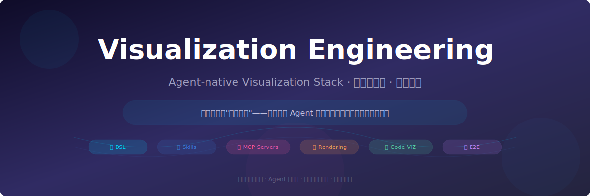
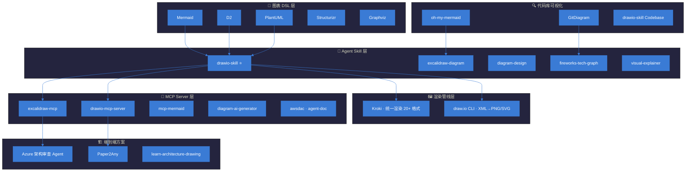
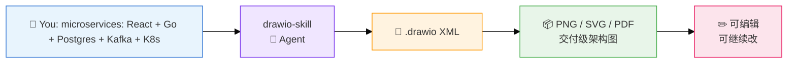
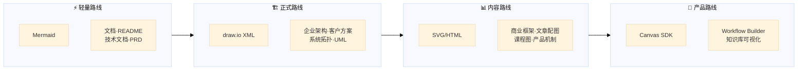

<p align="center">
  
</p>

<p align="center">
  <a href="#"></a>
  <a href="#"></a>
  <a href="#"></a>
  <a href="#"></a>
  <a href="#"></a>
  <a href="#"></a>
</p>

---

## What Is This

**A curated map of every visualization tool an AI Agent can directly use.**

Not "software that helps you draw". Not "libraries for web developers". This repo tracks **one thing only** — tools and frameworks where an AI Agent (Claude, GPT, Hermes, Cursor, etc.) can output structured visual artifacts directly: Mermaid, .drawio XML, SVG, HTML+SVG, Excalidraw JSON, Vega-Lite JSON.

> The bet: Agent-native visualization = **structured visual output generation**, not "AI operates a drawing app".

---

## Why This Exists

The landscape is moving fast — Mermaid is the standard for docs, draw.io XML is becoming the delivery format for enterprise architecture, MCP servers now let agents control canvas editors in real time. But nobody has mapped the full stack.

This repo fills that gap: **6 layers, 30+ projects, one map.**

---

## Architecture at a Glance



---

## Visual Showcase

What does "Agent-native visualization" actually look like? Here are example outputs from tools in this repo:



**More examples:**

| Input | Tool | Output |
|-------|------|--------|
| "帮我画一个用户登录流程图" | Mermaid |  → GitHub 原生渲染 |
| "这个 repo 的结构是怎样的" | GitDiagram |  → 交互式架构图 |
| "把这篇分析做成框架图" | diagram-design |  → 自包含截图/导出 |
| "画一个云架构图" | awsdac / diagram-ai |  → 多云架构 |
| "论文转 PPT/海报" | Paper2Any |  → 多格式 |

---

## Pick Your Scene

你不是从"层"开始的。你是从**要干什么**开始的。

```
┌─────────────────────────────────────────────────────────────────────┐
│  你是什么角色 / 要干什么                  → 先看哪个                    │
├─────────────────────────────────────────────────────────────────────┤
│  🔵 非程序员，想用 Agent 直出正式图表文件    → drawio-skill（已装）       │
│  🟢 写 README/文档要插图                   → Mermaid + mcp-mermaid    │
│  🟡 做内容/文章需要配图                     → diagram-design           │
│  🟣 研究 AI Agent / RAG，画技术图           → fireworks-tech-graph     │
│  🔴 经常 fork 开源项目，想快速理解代码结构   → GitDiagram               │
│  ⚪ 用 Obsidian 做知识库，要可视化           → Obsidian Canvas + Excalidraw │
│  🟠 想给团队搭自动出图服务                   → Kroki + drawio-skill     │
│  🔵 以后想做 Agent workflow builder 产品    → React Flow + tldraw      │
└─────────────────────────────────────────────────────────────────────┘
```

---

## Quick Start

```bash
# Route 1: Agent + Mermaid (fastest, for docs)
# Just put this in your markdown:
# ```mermaid
# graph TD; A-->B; B-->C;
# ```

# Route 2: Agent + drawio-skill (recommended, for delivery)
# Load the skill into any Agent framework
# → tell it "draw a microservices architecture"
# → get back .drawio XML → render with draw.io CLI

# Route 3: Agent + MCP Server (for interactive control)
# Install excalidraw-mcp or drawio-mcp-server
# Agent can now manipulate a live canvas in real time
```

See individual project files in each subdirectory for detailed usage.

---

## Project Catalog

### 📐 Layer 1: Diagram-as-Code DSL
*Agent 最舒服的输出格式 — 文本 → 图*

| Project | Pitch | Best For |
|---------|-------|----------|
| **[Mermaid](./01-diagram-as-code/mermaid.md)** ⭐ | 文档图事实标准，Markdown 里直接写 | README、PRD、流程图 |
| **[D2](./01-diagram-as-code/d2.md)** | 比 Mermaid 更现代的 DSL，布局引擎可换 | 严肃架构图 |
| **[PlantUML](./01-diagram-as-code/plantuml.md)** | UML 老大哥，生态最成熟 | UML、时序、部署图 |
| **[Structurizr](./01-diagram-as-code/structurizr.md)** | C4 model-as-code，一份 DSL 出多张图 | 企业架构文档 |
| **[Graphviz](./01-diagram-as-code/graphviz.md)** 🔥 | 图布局底层标准，万物之源 | 依赖图、关系图 |
| **[mingrammer/diagrams](./01-diagram-as-code/mingrammer-diagrams.md)** | Python 代码画云架构 | AWS/Azure/GCP 架构 |

### 🤖 Layer 2: Agent Skills
*这个仓库的核心 — 让 Agent 直接产出的能力单元*

| Project | Engine | Why It Matters |
|---------|--------|----------------|
| **[⭐ drawio-skill](./02-agent-skills/drawio-skill.md)** ✅ 已装 | draw.io | 自检修复 · 10k+ 形状 · 321 AI 图标 · 代码库→图 |
| **[excalidraw-diagram-skill](./02-agent-skills/excalidraw-diagram-skill.md)** | Excalidraw | 手绘风 Agent 直出，Playwright 渲染 |
| **[diagram-design](./02-agent-skills/diagram-design.md)** | HTML/SVG | 编辑级 · 品牌色匹配 · 14 种类型 |
| **[fireworks-tech-graph](./02-agent-skills/fireworks-tech-graph.md)** | SVG | 8 种视觉风格 · AI 领域模式 (RAG/Agent) |
| **[visual-explainer](./02-agent-skills/visual-explainer.md)** | HTML/Mermaid | 7 个命令 · 幻灯片 · Diff Review |
| **[architecture-diagram-generator](./02-agent-skills/architecture-diagram-generator.md)** | HTML | 深色主题 · 自包含 · Claude 技能 |
| **[tikz-diagrams-skill](./02-agent-skills/tikz-diagrams-skill.md)** | LaTeX | 学术论文级，数学/算法图 |
| **[softaworks/agent-toolkit](./02-agent-skills/softaworks-agent-toolkit.md)** | 合集 | 40+ 技能包，c4/draw-io/excalidraw/mermaid 都有 |

### 🔌 Layer 3: MCP Servers
*让 Agent 从"生成文件"进化到"直接操控画布"*

| Project | Engine | Value Add |
|---------|--------|-----------|
| **[excalidraw-mcp](./03-mcp-servers/excalidraw-mcp.md)**（官方）⭐ | Excalidraw | 流式手绘 · 无需 Key · MCP App |
| **[drawio-mcp-server](./03-mcp-servers/drawio-mcp-server.md)** | draw.io | 控制编辑器 · 多文档 · Mermaid 兼容 |
| **[diagram-ai-generator](./03-mcp-servers/diagram-ai-generator.md)** | diagrams | 多云架构 · 5 工具 · pip install |
| **[maaker-excalidraw-mcp](./03-mcp-servers/maaker-excalidraw-mcp.md)** | Excalidraw | 25+ 图类型 · CJK · 自动布局 |
| **[mcp-mermaid](./03-mcp-servers/mcp-mermaid.md)** | Mermaid | Agent 动态生成+校验 |
| **[claude-mermaid](./03-mcp-servers/claude-mermaid.md)** | Mermaid | Claude Code 实时预览+live reload |
| **[awsdac](./03-mcp-servers/awsdac.md)** | AWS | YAML→架构图，AWS 官方 |
| **[ai-diagram-maker-mcp](./03-mcp-servers/ai-diagram-maker-mcp.md)** | SaaS | 远程 MCP，API Key 接入 |
| **[AgentDoc](./03-mcp-servers/agent-doc.md)** | Mermaid C4 | 代码库→C4 文档 |

### 🖼 Layer 4: Rendering Pipeline
*DSL 转图片的最后一公里*

| Project | Pitch |
|---------|-------|
| **[Kroki](./04-rendering-pipeline/kroki.md)** | 统一 API 渲染 20+ 格式，Agent 不用关心具体渲染器 |
| **[draw.io CLI](./04-rendering-pipeline/drawio-cli.md)** | .drawio → PNG/SVG/PDF/JPG，支持可编辑嵌入 |

### 🔍 Layer 5: Codebase Visualization
*理解代码不用读代码*

| Project | Pitch |
|---------|-------|
| **[GitDiagram](./05-codebase-visualization/gitdiagram.md)** | GitHub URL 的 hub → diagram，秒出交互式架构图 |
| **[oh-my-mermaid](./05-codebase-visualization/oh-my-mermaid.md)** | Claude Code 理解代码库 → 结构清晰的架构图 |
| **[drawio-skill Codebase→图](./05-codebase-visualization/drawio-skill-codebase.md)** | Python/JS/Go/Rust import 图 + 类继承 |

### 📊 Layer 6: Data Visualization
*不是流程图，但有图*

| Project | Pitch |
|---------|-------|
| **[Vega-Lite](./06-data-visualization/vega-lite.md)** | JSON 语法定义交互式图表，Agent 输出最稳定 |

### 🎨 Layer 7: Canvas / Node Graph SDKs
*以后做产品用的*

| Project | Pitch |
|---------|-------|
| **[React Flow](./07-canvas-node-graph/react-flow.md)** | 工作流编辑器/Agent 流程 builder 的 UI 底座 |
| **[tldraw](./07-canvas-node-graph/tldraw.md)** | 无限画布，Make Real 把手绘变 HTML |
| **[Obsidian Canvas](./07-canvas-node-graph/obsidian-canvas.md)** | 知识库可视化落点 |

### 🏗 Layer 8: End-to-End
*完整的，但是重*

| Project | Pitch |
|---------|-------|
| **[Azure 架构审查 Agent](./08-end-to-end/azure-architecture-review-agent.md)** | 输入架构描述 → 风险分析 + Excalidraw 图 |
| **[Paper2Any](./08-end-to-end/paper2any.md)** | 论文 → draw.io 图 / PPT / 海报 / 视频 |
| **[learn-architecture-drawing](./08-end-to-end/learn-architecture-drawing.md)** | 提示词模板 + 多工具 SOP 指南 |

---

## 4 Product Routes

不同场景选不同路线：



| 路线 | 适合 | 缺点 | 代表组合 |
|------|------|------|----------|
| **① Mermaid** | README · PRD · 技术文档 | 复杂布局难控，正式交付感不够 | Mermaid + mcp-mermaid |
| **② draw.io XML ⭐** | 企业架构 · 客户方案 · 系统拓扑 | XML 长，需 skill 和校验 | drawio-skill + drawio-mcp-server |
| **③ SVG / HTML+SVG** | 商业框架图 · 文章配图 · 课程图 | 后续编辑不如 draw.io 方便 | diagram-design + visual-explainer |
| **④ Canvas / Node Graph** | Obsidian · Excalidraw · React Flow | 需要前端承载 | excalidraw-mcp + React Flow |

---

## State of the Stack

| 领域 | 状态 | 趋势 |
|------|------|------|
| **Mermaid** | ✅ 文档图标准答案 | 但不是所有场景的答案 |
| **draw.io XML** | 🚀 正式图表核心格式 | drawio-skill + drawio-mcp-server 都在押 |
| **Agent Skills 生态** | 🌱 刚起步 | 2025-2026 集中爆发，现在入场好时机 |
| **MCP 协议** | 🔥 从"生成文件"到"操控画布" | 正在改变 Agent 可视化能力下限 |
| **最大空白** | 🎯 缺端到端 Agent 工作流 | 文档/代码/业务分析 → 选引擎 → 出图 |

这个仓库会持续更新。PR welcome。

---

> 收录标准：开源 · Agent 可直出 · 结构化视觉产物 · 有维护活性
>
> 维护：[@ray-lee-coder](https://github.com/ray-lee-coder)
